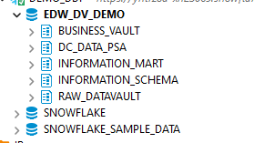
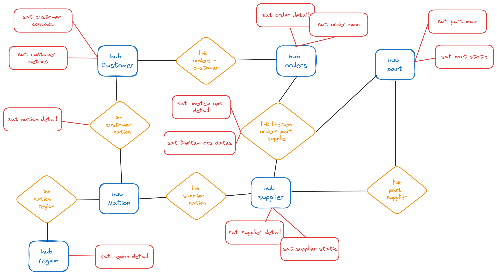
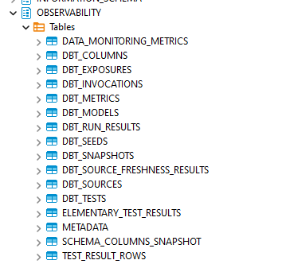
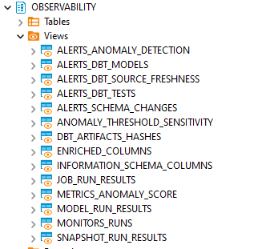
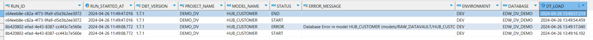
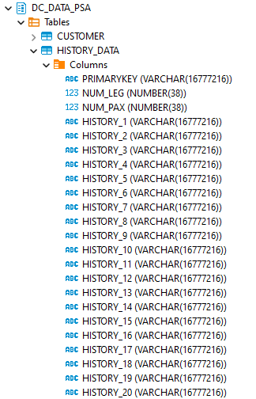
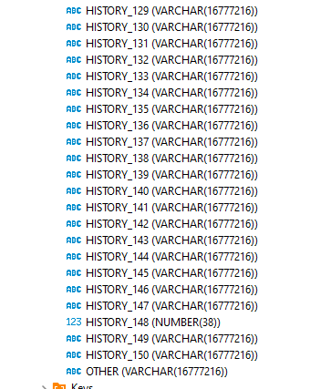
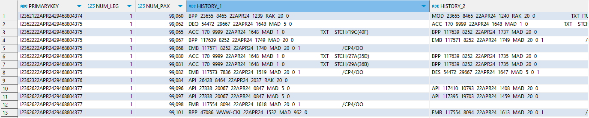
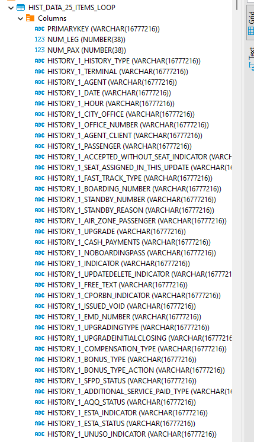
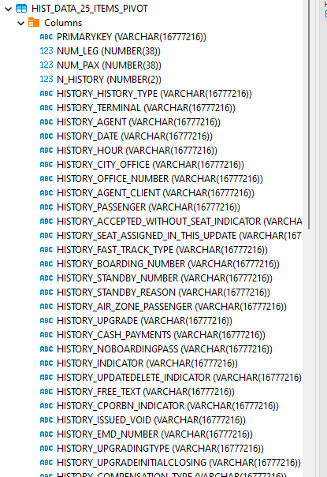

[descargarDocker]: https://www.docker.com/

[Model Versioning]: https://docs.getdbt.com/docs/collaborate/govern/model-versions
[Model Contracts]: https://docs.getdbt.com/docs/collaborate/govern/model-contracts
[dbt Elementary]:https://hub.getdbt.com/elementary-data/elementary/latest/
[Project references]:https://docs.getdbt.com/docs/collaborate/govern/project-dependencies

[DATA_HISTORY_ORIG.sql]:projects/demo_dv/models/DATA_TRANSFORM/
[DATA_HISTORY_LOOP.sql]:projects/demo_dv/models/DATA_TRANSFORM/
[DATA_HISTORY_PIVOT.sql]:projects/demo_dv/models/DATA_TRANSFORM/
[RAW_DATAVAULT]:projects/demo_dv/models/RAW_DATAVAULT/
[RAW_DATAVAULT/SAT_CUSTOMER_CONTACT.sql]:projects/demo_dv/models/RAW_DATAVAULT/SAT_CUSTOMER_CONTACT_v1.sql
[set_query_tag]:projects/demo_dv/macros/
[dbt_project.yml]:projects/demo_dv/dbt_project.yml
[INFORMATION_MART]:projects/demo_dv/models/INFORMATION_MART/
[STAGING/CUSTOMER_REF.sql]:projects/demo_dv_ref/models/STAGING/CUSTOMER_REF.sql
[log_model.sql]:projects/demo_dv/macros/
[seed sample file]:projects/demo_dv/seeds/


# dbt demo project: Datavault

The goal of this repository is to create a project that can be utilized and distributed throughout the community. Ideally, this project would serve as a place for integrating new functionalities and features that are accessible to all, fostering a collaborative environment where everyone can reuse, improve and comprehend its workings. 

The repository contains 2 dbt projects. 'demo_dv' and 'demo_dv_ref'. The main project and the one that has built all functionalities in is 'demo_dv'. Ref project has been created to test the project reference functionality but does not work as it is only available in dbt_cloud Enterprise edition.

<br>


# Table of Contents
1. [How to Start](#how-to_start)
    1. [Requirements](#requirements)
    2. [Preparation of the environment](#preparation)
    3. [Using dbt-cloud](#dbtcloud)
    4. [Using dbt-core](#dbtcore)        
2. [Functional Model](#Functional-Model)
3. [Functionalities](#Functionalities)
    - [Model Vars](#Model_Vars)
    - [Query Tagging in Snowflake](#QueryTag)
    - [Query comments](#QueryComments)
    - [Contract Enforcement](#ContractEnforcement)
    - [Model Versioning](#ModelVersioning)
    - [Multi-Project References](#Project_reference)
    - [Tests](#Tests)
    - [dbt_elementary](#Elementary)
    - [Observability](#Observability)
    - [Profiles folder](#Profiles)
    - [Jinja examples](#Jinja)    
        - [Loops](#JinjaLoops)
        - [Pivoting](#JinjaPivoting)
4. [Best practices](#BestPractices)    
    - [Model YML configuration](#ModelYML)
    - [Environment variables](#Env_vars)
    

<div id='how-to_start'/>
<br>

## How to start 

<br>

<div id='requirements'/>
<br>

### Requirements

 - Snowflake account

 - Snowflake UI or database manager to execute SQL scripts

 - A development tool (VS, InteliJ) to be used if dbt-core

 - Connection to a Github account

<div id='preparation'/>
<br>

### Preparation of the environment

In order to correctly set up the environment and use this project, follow these steps: 


- Login into your Snowflake account.

- Go to the SCRIPTS directory:

        dt-demo-dbt-datavault\sql_scripts

- Execute both scripts in the following order: 

        00_init_snowflake.sql
        01_init_db.sql
        01_init_db_prod.sql -- Needed if you want to test different environments

(*Execute them either in the Snowflake web UI or any db tool like dbeaver)

The execution of the scripts will be create the following database and schema structure: 





You can login with 'SDGUSER' user and password. 'SDGADMIN' is the role created with the appropiate permissions.

The script also creates the tables for the incremental models.

<div id='dbtcloud'/>
<br>

### Using dbt cloud
    
- Connect to dbt-Cloud account.

- Go to Settings -> Projects and look for: 'dt-demo-dbt-datavault'

- In project details, click on Connection->Snowflake 

- Then click on 'Edit' at the bottom

- Update the Account with your own account.

- You are ready to run a 'dbt run'

<div id='dbtcore'/>
<br>


### Using dbt-core

- Clone git repository.

- Export the following environment variables, just update the SNOW_ACCOUNT with your own:

    ```sh
    $ export DBT_SNOW_ACCOUNT=xxxxx-yyyyy
    $ export DBT_SNOW_USER=SDGUSER
    $ export DBT_SNOW_PASSWORD=SDGUSER
    $ export DBT_SNOW_DATABASE=EDW_DV_DEMO
    $ export DBT_SNOW_SCHEMA=RAW_DATAVAULT
    $ export DBT_SNOW_ROLE=SDGADMIN
    $ export DBT_SNOW_WAREHOUSE=EDW_WH
    ```

- Go to directory projects/devo_dv

- You might need to install dependencies in case you did not do this before: 

    ```sh
    $ dbt deps
    ```

- And also generate all elementary observability tables

    ```sh
    $ dbt run --profiles-dir ../../profiles/snowflake --select package:elementary
    ```
- We are now ready to perform 'dbt run' as follows:
        
    ```sh
    $ dbt seed --profiles-dir ../../profiles/snowflake
    
    # Execution by layers    
    $ dbt run --profiles-dir ../../profiles/snowflake --select tag:DT
    $ dbt run --profiles-dir ../../profiles/snowflake --select tag:RDV
    $ dbt run --profiles-dir ../../profiles/snowflake --select tag:BDV
    $ dbt run --profiles-dir ../../profiles/snowflake --select tag:IM
    
    # Full execution of the project
    $ dbt run --profiles-dir ../../profiles/snowflake 

    ```


<div id='Functional-Model'/>
<br>


## Functional Model

For the purpose of this DEMO, a simple Data Vault model has been created.
It consists of:

 - Raw Data Vault Layer
     - 6 Hub elements
     - 6 Link elements 
     - 12 Satellites 
 - Business Data Vault Layer
     - 7 PIT tables
     - 3 PIT views
 - Information Mart Layer
     - 2 Tables


The Raw Data Vault model looks like this:




<div id='Functionalities'/>
<br>

## Functionalities

<div id='Model_Vars'/>
<br>

### Model Vars

For the purpose of project testing, a project variable called 'cod_tenant' has been included which, in the demo version is initialized to 'SDG_ES' in the dbt_project.yml file. This value can be overwritten at runtime (dbt run) using the following command:
    
```sh
# in dbt-core:
    dbt run --profiles-dir profiles/snowflake --vars " { 'cod_tenant':'Other_tenant' } "

#in dbt-cloud:
    dbt run  --vars " { 'cod_tenant':'Other_tenant' } "
```            


<div id='QueryTag'/>
<br>


### Query Tagging in Snowflake
The current project is able to update the query_tag in Snowflake for each model. That is, it is capable of assigning a different tag to the executions and encapsulating all that occur within the same model. This can help us identify which queries are executed in each model and assist in the identification of associated costs.

To achieve this, the "[set_query_tag]" macro has been overridden. In it, you can observe the pattern that has been established and can be customized. In this case, it is: "DBT_ + project name + tenant + model".

```python
 
```

An example of our query_tag:
    
    DBT_DEMO_DV_SDG_ES_SATL_LINEITEM_OPS_DATES

This funcionality only works in Snowflake and can be disabled in the dbt_project.yml file by setting the 'query_tagging' variable to 'FALSE':

```yml
# enable query tag: 
    query_tagging: "TRUE"    
# disable query tag: 
    query_tagging: "FALSE"
```

<div id='QueryComments'/>
<br>


### Query comments
The current project adds an JSON-formatted comment at the end of every query in which, it shows a lot of details about the execution.
The macro used is "query_comment" and is setup in the '[dbt_project.yml]' file.

An example of this comment is: 

In query: 

```sql

insert into EDW_DV_DEMO.RAW_DATAVAULT.SAT_ORDERS_MAIN ("HUB_ID_ORDERS", "TENANT", "STATUS", "ORDER_DATE", "TOTAL_PRICE", "DT_LOAD", "HASH_DIFF", "RECORD_SOURCE")
    (
    select "HUB_ID_ORDERS", "TENANT", "STATUS", "ORDER_DATE", "TOTAL_PRICE", "DT_LOAD", "HASH_DIFF", "RECORD_SOURCE"
    from EDW
    _DV_DEMO.RAW_DATAVAULT.SAT_ORDERS_MAIN__dbt_tmp
    )
```


Comment added is: 

```sql
/* {"app": "dbt", "dbt_version": "1.7.1", "profile_name": "demo_dv", "target_name": "dev", "file": "models/RAW_DATAVAULT/SAT_ORDERS_MAIN.sql", "node_id": "model.demo_dv.SAT_ORDERS_MAIN", "node_name": "SAT_ORDERS_MAIN", "resource_type": "model", "depends_on": null, "package_name": "demo_dv", "relation": {"database": "EDW_DV_DEMO", "schema": "RAW_DATAVAULT"}} */;
```    


The code for this functionality is located at the end of the dbt_project.yml file, in: 

```yml
query-comment:
comment: "{{ query_comment(node)}}"
append: true
```

<div id='ContractEnforcement'/>
<br>


### Contract Enforcement

[Model Contracts] is a functionality that allows us to fix the physical structure of a model and prevents changes to it unless said contract changes and is notified to its consumers.
This functionality is related to the Data Mesh methodology and is part of the dbt_mesh.
The idea is that each Data Provider generates a contract for each table it publishes and has any consumers who read from that table. In this way, both parties ensure data integrity.

The way to enforce the structure of a model is done through the following code in the model's configuration file:

```yml
config:
contract:
    enforced: true
```        

It should be noted that when a contract is enforced, all columns of the model must be defined in the configuration file, as well as their data type. If this does not happen, dbt throws a compilation error.

Also, the parameter 'on_schema_change' has to be set to a value. In our case to 'fail'.

The functionality has been implemented in [RAW_DATAVAULT] models of type HUBS and LINKS, as well as models of [INFORMATION_MART]."


<div id='ModelVersioning'/>
<br>

### Model Versioning
[Model Versioning] is recent in dbt and potentially complex to maintain.It's associated with the Data Mesh methodology.

The affected model in this project is [RAW_DATAVAULT/SAT_CUSTOMER_CONTACT.sql], of which there are two versions, v1 and v2. Initially, the model did not have the suffix, but according to the current configuration of dbt, at some point, the original model must be renamed when it is no longer the 'latest' version. Therefore, it has been decided to rename it as soon as the new version is created.
    
    SAT_CUSTOMER_CONTACT_v1.sql
    SAT_CUSTOMER_CONTACT_v2.sql


For both SQL files, the original yml file must be used to generate their configuration and validate the structure of their contract.
In this example, in version 2, a new column has been added to the model.
Contract is enforced in both versions. The 'latest' version is 2, according to the YAML.

On the other hand, the macro 'create_latest_version_view.sql' has been added to the project. This macro updates a view pointing to the table defined as 'latest' with each execution so that subsequent systems are not affected.


<div id='Project_reference'/>
<br>

### Multi-Project references

This demo project intends to use the functionality of [Project references]. This functionality is only available in dbt_cloud enterprise edition.

The project that contains the reference is 'demo_dv_ref' in which, the model [STAGING/CUSTOMER_REF.sql] should point to any HUB/SAT/PIT/FACT containing customer data. Currently it is configured to point to a source.

As this is an option only available in the enterprise edition, this functionality cannot be tested now.


<div id='Tests'/>
<br>


### Tests
All types of generic tests have been created. Refer to any model yml file.

There is one singular test in the tests folder.


<div id='Elementary'/>
<br>


### dbt_elementary
[dbt Elementary] data Package has been added to the project. 

Refer to the dependencies.yml file to see how this can be added to the project.

The database and schema that will create all tables and store the results is configured in the [dbt_project.yml]

```yml
elementary:
    +database: EDW_DV_DEMO
    +schema: OBSERVABILITY
```


In order to have this package installed, it needs to be run a 'dbt deps'.

This package helps with the observability. It will load the results of every execution of the project into a series of tables under the schema defined in the yml.






<div id='Observability'/>
<br>


### Customized Observability

The current process is developed to log the start and end of every model, along with possible errors into a customized table.
There is a Macro called '[log_model.sql]' in the Macro's directory that collects model information, and loads the timestamp of the init of the model and the End (if successful)

This allows us to have a real-time execution log.

'[log_model.sql]' macro is invoked in every single model by the [dbt_project.yml] file as a pre_hook and a post_hook.
Argument 'status' is given as input parameter to define the start or end status. Please take this macro as an initial point to start your customization of the observability.

    models:

    demo_dv:
        +pre_hook:
        - "{{ log_model( status='START' ) }}"
        +post_hook: 
        - "{{ log_model( status='END' ) }}"


Errors are handled in macro log_results and is used in the 'on-run_end' process in dbt.

    on-run-end: 
    - "{{ log_results( results ) }}"  





<div id='Profiles'/>
<br>


### Profiles folder
It has been created a folder at the same level as the project folder to store the different profiles. 
If using dbt-core, this folder has to be passed as argument as stated above.

        $ dbt run --profiles-dir ../../profiles/snowflake


<div id='Jinja'/>
<br>

### Jinja Examples

<div id='JinjaLoops'/>
<br>

#### Loops
There is a dbt [seed sample file] that is loaded with every dbt build.
This seed contains a particularly complex structured file with 3 initial columns and a set of 150 structured data items called 'history_N' 





Every item is also splitted into 56 different items, making a total of 8600 distinct data items. It is a 2-level hierarchy structre with 2 different delimiters. 1st level delimiter is a comma ',' (originally was start of header ascii code ( SOH-\001) but for dbt simplicity it has been changed to a comma) and second level delimter is the Start of Text (STX - \002) ascii code.




Using this table and trying to load all information into a subsequent layer could be a challenge and our dbt model could be endless. As an example, there is a model that only loads 25 iterations of this file ([DATA_HISTORY_ORIG.sql]), and it has more than 1400 lines of code. So, we can multiply this by 6 to get the 150 iterations. 

This is a good example of how to apply a loop in Jinja so that we can configure it to iterate over the list of 25. Example available in model '[DATA_HISTORY_LOOP.sql]'.

In this case we can define a range of 1 to 25:

    
    

 and loop over the list using jinja code like: 

    SELECT ...
         
    
        history_{{m}} AS history_{{m}}_history_type, 
    
    
    FROM ...

By doing this, our code is reduced to 70 lines, bearing in mind that there are 56 colums for each iteration, and our table would look like the same as the original:




<div id='JinjaPivoting'/>
<br>

#### Pivoting

The same example seen in the loops can be pivoted so that we don´t need to store all iterations as columns, but the are stored as rows. This would make querying for our data much easier.
Example of how to pivot this use case can be found in model '[DATA_HISTORY_PIVOT.sql]'.

The particularity of this model is that we also store the iteration number as a column, so, instead of having HISTORY_TYPE_1, HISTORY_TYPE_2..., we now have N_HISTORY as a separate column, and another column called HISTORY_TYPE.

In this model, we reuse the definition from the previous section, but apply the loop before the SELECT statement


    
    

        
    SELECT ...
   
      	{{ m }} as n_history,
        history_{{m}} AS history_type, 
    
    FROM ...


Here comes the second difference, in order to actually pivot, we need to loop over the selects using a 'UNION' clause like this: 

     
        union all
    
    


By using this pivoting strategy, our table would only have the necessary columns, and will have a iteration id, instead of having hundreds or thousands of columns.




<div id='BestPractices'/>
<br>


## Best practices


<div id='ModelYML'/>
<br>


### Model YML configuration

For better maintenance, every 'sql' model has an associated 'yml' file that contains its definition.


<div id='Env_vars'/>
<br>


### Environment variables
All environment variables should start with 'DBT_'


<div id='Contact'/>
<br>
